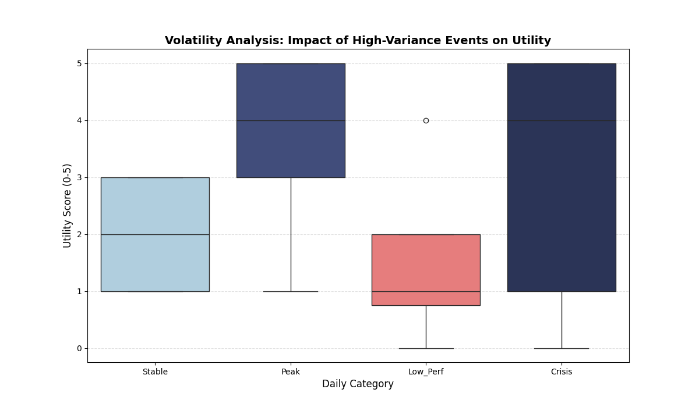

# 📊 Personal Volatility & Utility Analysis

### 📌 Overview
This project serves as a behavioral economics simulation designed to test a specific hypothesis: **"Do high-volatility days (crises), despite their negative nature, yield higher long-term utility (life experience) compared to stable routine days?"**

Using **Python**, I simulated a 365-day dataset representing personal mood fluctuations and measured their resulting "Utility Score" based on a weighted probability algorithm.

### 🛠️ Tech Stack
* **Python 3.x**
* **Pandas & NumPy** (Data Simulation)
* **Seaborn & Matplotlib** (Statistical Visualization)

### 📈 Key Findings
The analysis revealed a counter-intuitive insight:
* **"Stable" Days** (Routine) provided consistent but average utility (~1.9/5.0).
* **"Crisis" Days** (High Volatility) showed extreme variance but a **higher average utility (~2.9/5.0)** than routine days.
* *Conclusion:* Negative outliers (crises) act as "High Risk / High Reward" events, contributing significantly to personal growth compared to standard low-performance days.

### 📉 Analysis Visual
Below is the boxplot analysis showing the variance and utility distribution across categories:

---
*Author: Ömer Faruk Bilgiç*
